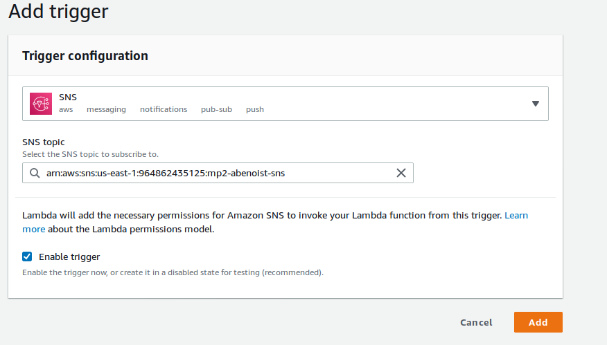
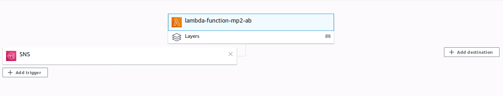
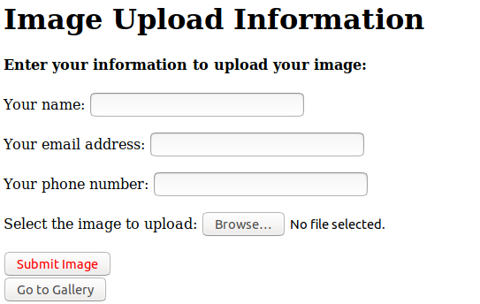
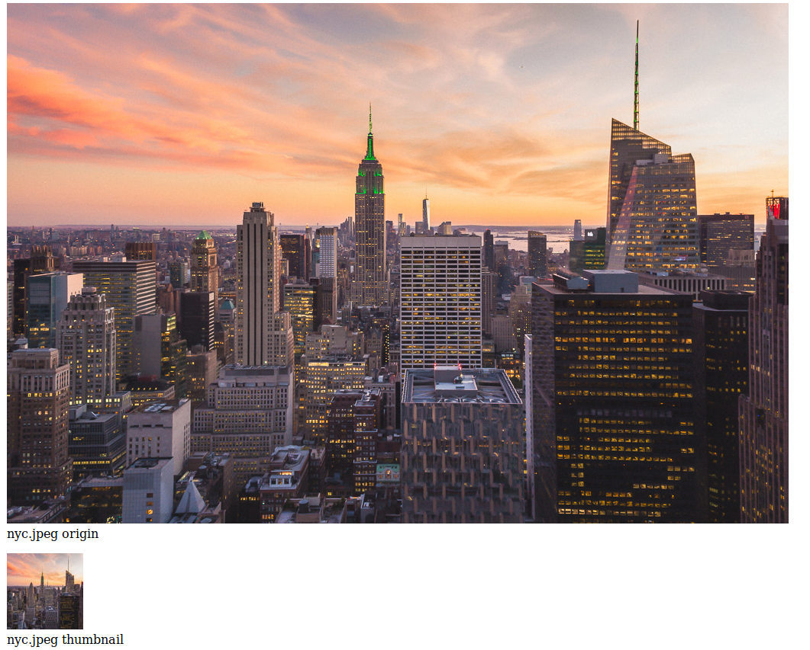
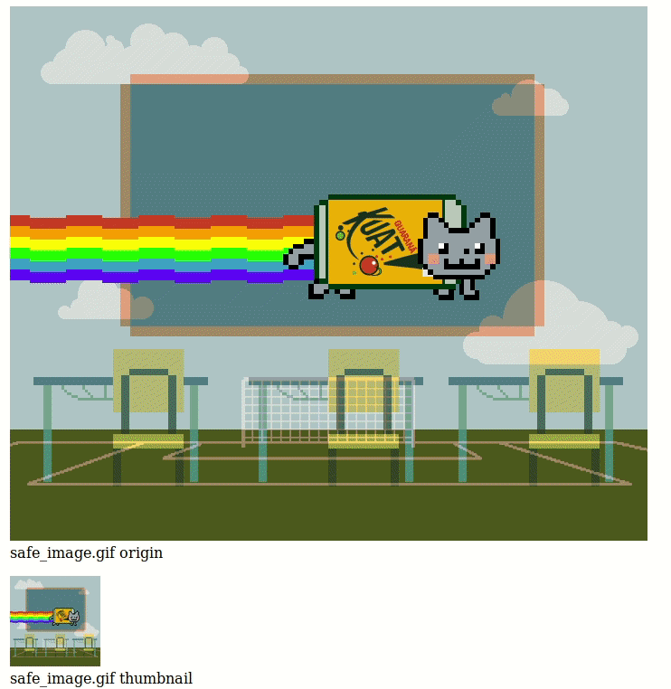

# Introduction: Journey to the Three-tier world

For this Final project, we need to createand deploye a Three-tier cloud native web-app with three pages:

-   index.html : The user put his personnal information (email address, phone number, name) and can submit his image with a "submit" button;
-   galery.php : Read the database and retrieve the pictures;
-   submit.php : Put the image into the proper S3 bucket, store the URL in the database and Trigger the Lambda Function.


The infrastructure of the project is :

-   Load Balancer attach to an autoscaling group (3 instances desire, 2 minimum and 4 maximum);
-   Two S3 bucket : one for pre-processing and one for post-processing;
-   DynamoDB : the database;
-   SNS Topic : To trigger the Lambda function and send SMS to the user;
-   Lambda function : Process the image, put it into the proper S3 bucket, update the database, notify the user (written in python).

# Run the project

To deploy the project, you must run a chmod +x with the three bash script ; create-env.sh (create the infrastructre), install-app-env.sh (install any dependencies) and destroy-env.sh (destroy the infrastructure):
```shell
chmod +x create-env.sh
chmod +x install-app-env.sh
chmod +x destroy-env.sh
```

### Create the environment

To create the environment of the application you need to run the create-env.sh script with the following options:
1.  Image ID: the custom ami with the RSA key for my github repository;
2.  Lambda role ARN: Your lambda role ARN, please make sure you have the following policy attahced to your lambda role:
        
    -   AmazonS3FullAccess;
    -   AmazonDynamoDBFullAccess;
    -   AWSLambdaDynamoDBExecutionRole;
    -   AmazonSNSRole;
    -   AWSLambdaInvocation-DynamoDB;
    -   AmazonSNSFullAccess.
        
3.  Instance Type;
4.  KeyPair Name: Your aws key pair;
5.  Security Group ID: Be sure to have a secure group which allow MYSQL, HTTP,... connexion;
6.  IAM profile/role: your IAM profile, be sure to have all power;
7.  first subnet ID: Choose a subnet ID in us-east-1 region for the load balancer;
7.  second subnet ID: Choose a subnet ID in us-east-1 region.

For example, I run this command with my option as shown *infra*:
```shell
./create-env.sh ami-03c89883e006be6de arn:aws:iam::964862435125:role/service-role/test-role-vmdz3z69 t2.micro MyfirstKeyUbuntuBionic3 sg-03d2b4484c3f7d7d2 ITMO-544 subnet-2783fb19 subnet-ffeedfa3
```
After the environment has been created, you will need to add the SNS trigger to the lambda function manually with the AWS console (GUI). To do that, please go to https://console.aws.amazon.com/lambda/home?region=us-east-1#/functions, select the created function, click on the "Add Trigger" button on the left side and add the SNS trigger ine the trigger menu like this:



When the SNS trigger has added to the lambda function, the lambda menu should look like this:



*Note: You need to add the trigger manually because AWS doesn't allow to do it with the command line or with his PHP SDK for the SNS trigger. (More information: https://docs.aws.amazon.com/cli/latest/reference/lambda/create-event-source-mapping.html and https://docs.aws.amazon.com/aws-sdk-php/v3/api/api-lambda-2015-03-31.html#createeventsourcemapping)*

### Destroy the environment

To destroy the emvironment, you juste need to run the destroy-env.sh script and it will destroy all the environment:
```shell
./destroy-env.sh
```
# The application

The install-app-env.sh will launch the application automatically by cloning my repository and install all the dependencies on the instances.

Once the environment is installed, allow 2-3 minutes for the load balancer to be ready and go to his DNS address (You may see a "502 Bad Gateway" error, please wait a little bit longer for my repository to be cloned and for the copy of all the application). You should see the index of the application.
The website use cookies.



Please enter all the information asked and choose the image you want to upload.
*Note*: The animated gif also work but it takes more time to process them.

If you only want to see your uploaded images, you can just click on the "Go to Gallery" button. 

Once the process is finished (thanks to the submit.php page), you should be able to see your galery with the images you already uploaded and the new one in the end as shown *infra*:





At the very bottom of the application you will see a "Return Home" button to go back to the index if you want to upload more images.

When you're going to submit an image, you should receive two text message:
1.  Saying that your image is being processed;
2.  Your receipt and email address.

When the image has been processed, you should receive a third text message, saying:
1.  Please Refresh your gallery page to see your processed image.

*Note*: You may not receive text message, it is because SNS has some bug to treat the SMS (At the time I'm writting this ReadMe, the text message delivery rate is only at 54.76%) due to the aws free-tier. So if this happen, please allow 1 minute before refreshing your gallery page.

Idea to improve the project: We could use the Twitter API and when an image is porcessed, tweet the link of the image for example. 

