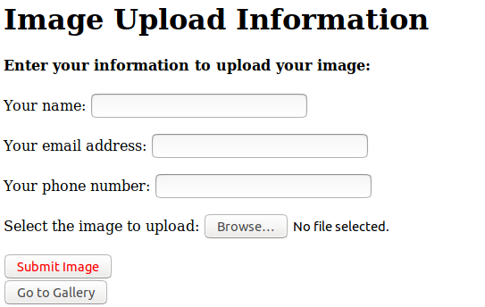
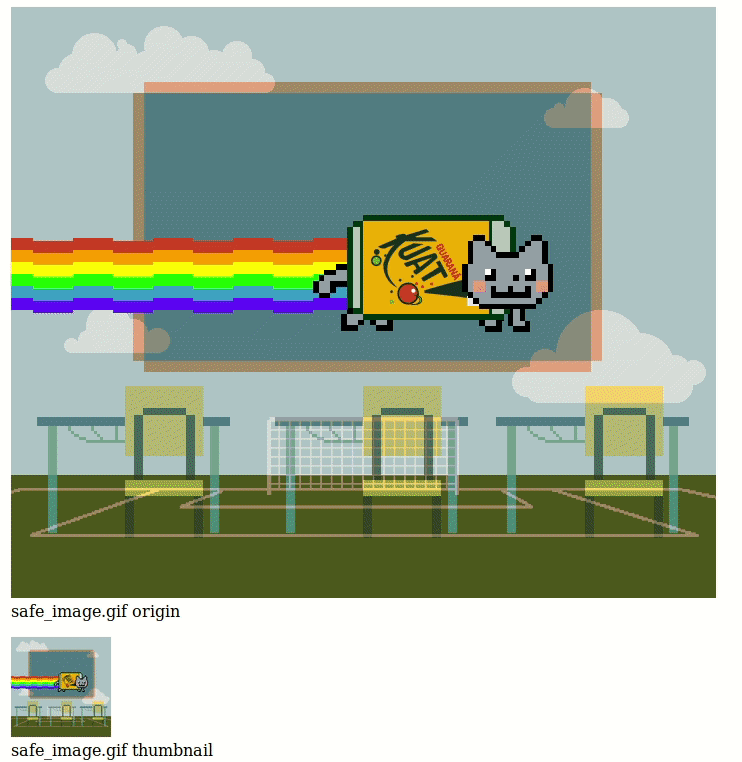

# Introduction

For this Midterm project, we need to create a web application with 3 pages : 

-   index.html : The user put his personnal information (email address, phone number, name) and can submit his image with a "submit" button;
-   galery.php : Read the database and retrieve the pictures;
-   submit.php : Put the image into the proper S3 bucket, store the URL in the database and create an thumbnail of the image. And update the database.

The infrastructure of the project is :

-   Load Balancer;
-   Two instances behind the load balancer;
-   Two S3 bucket : one for pre-processing and one for post-processing;
-   RDS instances : the database.

# Run the project

To deploy the project, you must run a chmod +x with the three bash script ; create-env.sh (create the infrastructre), install-app-env.sh (install any dependencies) and destroy-env.sh (destroy the infrastructure):
```shell
chmod +x create-env.sh
chmod +x install-app-env.sh
chmod +x destroy-env.sh
```

### Create the environment

To create the environment of the application you need to run the create-env.sh script with the following options:
1.  Image ID: the custom ami with the RSA key for my github repository: ami-03c89883e006be6de;
2.  count: number of instance you want to create;
3.  Instance Type;
4.  KeyPair Name: Your aws key pair;
5.  Security Group ID: Be sure to have a secure group which allow MYSQL, HTTP,... connexion;
6.  IAM profile/role: your IAM profile, be sure to have all power;
7.  subnet ID: Choose a subnet ID in us-east-1 region.
8.  subnet ID: Choose a subnet ID in us-east-1 region for the Load Balancer

For example, I run this command with my option as shown *infra*:
```shell
./create-env.sh ami-03c89883e006be6de 2 t2.micro MyfirstKeyUbuntuBionic3 sg-03d2b4484c3f7d7d2 ITMO-544 subnet-2783fb19 subnet-ffeedfa3
```
Make sure you have the dependencies on the vagrant Virtual Box : php. (otherwise run ```sudo apt-get install php``` first).
Please wait a minimum of five minutes for the RDS instance to be available.

*Note*: The Username and Password to access to the database are hardcoding in the script.

### Destroy the environment

To destroy the emvironment, you juste need to run the destroy-env.sh script and it will destroy all the environment, including the files in the S3 buckets:
```shell
./destroy-env.sh
```
### The application

The install-app-env.sh will launch the application automatically by cloning my repository and install all the dependencies on the instances.

Once the environment is installed, allow 2-3 minutes for the load balancer to be ready and go to his DNS address. You should see the index of the application.
The website use cookies.



Please enter all the information asked and choose the image you want to upload.
*Note*: The animated gif also work but it takes more time to process them.

If you only want to see your uploaded images, you can just click on the "Go to Gallery" button. 

Once the process is finished (thanks to the submit.php page), you should be able to see your galery with the images you already uploaded and the new one in the end as shown *infra*:




At the very bottom of the application you will see a "Return Home" button to go back to the index if you want to upload more images.


